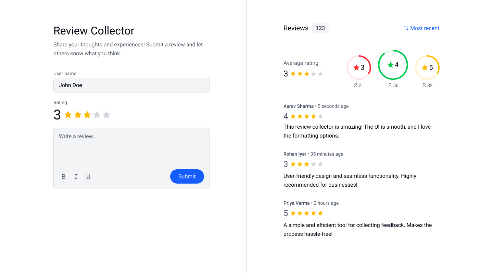

# Review Collector

Review Collector is a simple web-based application that allows users to submit, view, and manage reviews. It provides an interactive interface for users to rate experiences and leave written feedback. The application dynamically updates ratings and displays reviews in real-time.



## Live Demo

[View Live Review](#)

## Features

- User-friendly review submission form
- Star rating system for quick feedback
- Rich text editor for review customization
- Live review updates and sorting functionality
- Real-time average rating calculation
- Responsive design using Tailwind CSS

## Technologies Used

- HTML
- CSS
- JavaScript

## Setup & Installation

1. Clone the repository:
   ```sh
   git clone https://github.com/janarahul1234/rating-and-review-collector.git
   ```
2. Navigate to the project directory:
   ```sh
   cd rating-and-review-collector
   ```
3. Open `index.html` in a web browser.

## Usage

1. Enter your name in the "User name" field.
2. Select a star rating from 1 to 5.
3. Type your review in the text box (supports bold, italic, and underline styling).
4. Click "Submit" to add your review.
5. View submitted reviews on the right panel.
6. Sort reviews by "Most Recent" or "Oldest."

## License

This project is licensed under the MIT License.
